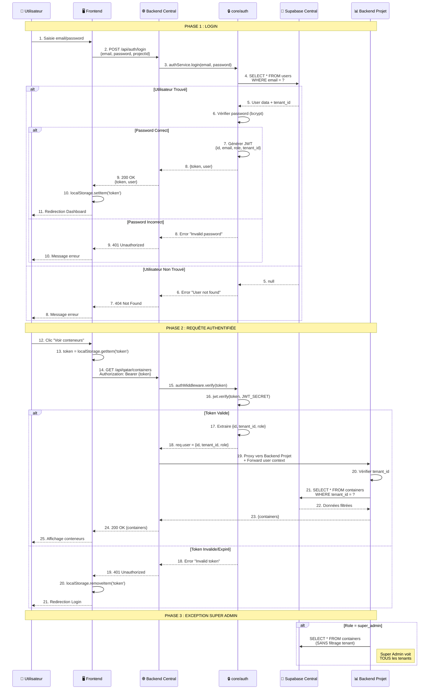
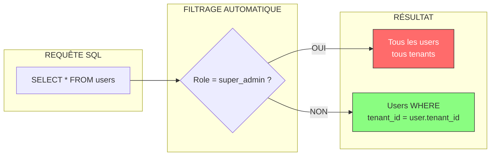
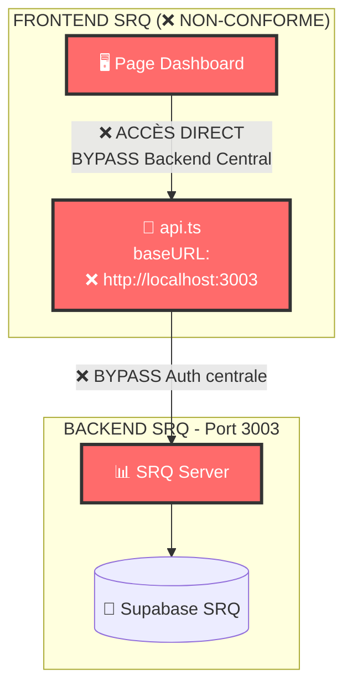
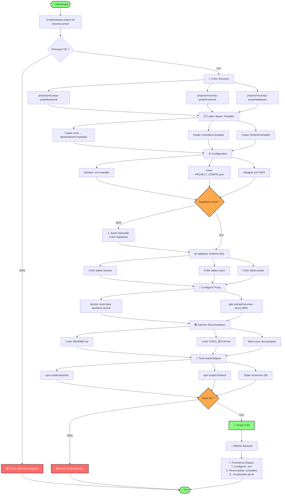
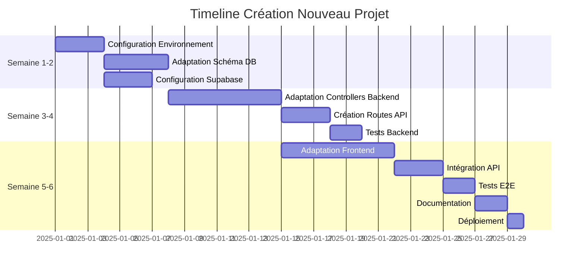

# 📐 DIAGRAMMES ARCHITECTURE COMPLÈTE - HEARST CONTROL V2.0

> **Date** : 24 Décembre 2025  
> **Version** : 2.0.0  
> **Format** : Mermaid (intégrable GitHub/Markdown)  
> **Statut** : ✅ **COMPLET**

---

## 📑 TABLE DES MATIÈRES

1. [Architecture Globale](#1-architecture-globale)
2. [Flux d'Authentification](#2-flux-dauthentification)
3. [Isolation Multi-Tenant](#3-isolation-multi-tenant)
4. [Structure Fichiers](#4-structure-fichiers)
5. [Flux de Requête Frontend](#5-flux-de-requête-frontend)
6. [Déploiement Nouveau Projet](#6-déploiement-nouveau-projet)

---

## 1. ARCHITECTURE GLOBALE

### Diagramme Système Complet

```mermaid
graph TB
    subgraph "UTILISATEURS"
        U1[👤 Utilisateur Qatar]
        U2[👤 Utilisateur Design]
        U3[👤 Utilisateur SRQ]
        U4[👤 Super Admin]
    end

    subgraph "APPLICATION ELECTRON"
        ELECTRON[🖥️ Interface Electron<br/>Application de Bureau]
    end

    subgraph "BACKEND CENTRAL - Port 4000"
        BC[🌐 API Gateway]
        AUTH[🔐 Auth Controller]
        USERS[👥 Users Controller]
        PROJ[📊 Projects Controller]
        DASH[📈 Dashboard Controller]
    end

    subgraph "CORE - Code Commun 70-80%"
        CORE_AUTH[🔒 authService.js]
        CORE_MW[🛡️ authMiddleware.js]
        CORE_DB[💾 supabaseClient.js]
        CORE_UTILS[🔧 shared-utils/]
    end

    subgraph "PROJETS ISOLÉS"
        subgraph "QATAR - Port 3001"
            Q_BE[Backend Qatar]
            Q_FE[Frontend Qatar]
            Q_DB[(🗄️ Supabase Qatar)]
        end

        subgraph "DESIGN - Port 3002"
            D_BE[Backend Design]
            D_FE[Frontend Design]
            D_DB[(🗄️ Supabase Design)]
        end

        subgraph "SRQ - Port 3003"
            S_BE[Backend SRQ]
            S_FE[Frontend SRQ]
            S_DB[(🗄️ Supabase SRQ)]
        end
    end

    subgraph "DATABASE CENTRALE"
        CENTRAL_DB[(🗄️ Supabase Central<br/>tenants | users | projects)]
    end

    %% Connexions Utilisateurs
    U1 & U2 & U3 & U4 --> ELECTRON
    ELECTRON --> BC

    %% Backend Central utilise Core
    BC --> AUTH
    BC --> USERS
    BC --> PROJ
    BC --> DASH
    
    AUTH --> CORE_AUTH
    USERS --> CORE_AUTH
    PROJ --> CORE_AUTH
    DASH --> CORE_AUTH

    CORE_AUTH --> CORE_MW
    CORE_AUTH --> CORE_DB
    CORE_AUTH --> CORE_UTILS

    %% Connexion Database Centrale
    CORE_DB --> CENTRAL_DB

    %% Routing Backend Central vers Projets
    BC -.->|Proxy /api/qatar| Q_BE
    BC -.->|Proxy /api/design| D_BE
    BC -.->|Proxy /api/srq| S_BE

    %% Projets utilisent Core
    Q_BE --> CORE_AUTH
    D_BE --> CORE_AUTH
    S_BE --> CORE_AUTH

    %% Projets vers leurs DB
    Q_BE --> Q_DB
    D_BE --> D_DB
    S_BE --> S_DB

    %% Style
    classDef coreStyle fill:#8afd81,stroke:#333,stroke-width:2px,color:#000
    classDef centralStyle fill:#4a9eff,stroke:#333,stroke-width:2px,color:#fff
    classDef projectStyle fill:#ffa94d,stroke:#333,stroke-width:2px,color:#000
    classDef dbStyle fill:#ff6b6b,stroke:#333,stroke-width:2px,color:#fff
    
    class CORE_AUTH,CORE_MW,CORE_DB,CORE_UTILS coreStyle
    class BC,AUTH,USERS,PROJ,DASH centralStyle
    class Q_BE,D_BE,S_BE,Q_FE,D_FE,S_FE projectStyle
    class CENTRAL_DB,Q_DB,D_DB,S_DB dbStyle
```

### Légende

| Couleur | Composant | Rôle |
|---------|-----------|------|
| 🟢 Vert | **CORE** | Code commun réutilisable (70-80%) |
| 🔵 Bleu | **Backend Central** | API Gateway + Auth centralisée |
| 🟠 Orange | **Projets** | Backends/Frontends isolés |
| 🔴 Rouge | **Databases** | Supabase (Central + Projets) |

---

## 2. FLUX D'AUTHENTIFICATION

### Séquence Complète JWT Multi-Tenant



### Points Clés du Flux

1. **JWT Contient Toujours** :
   ```json
   {
     "id": "uuid-user",
     "email": "user@domain.com",
     "role": "admin",
     "tenant_id": "uuid-tenant",  ← OBLIGATOIRE
     "iat": 1703462400,
     "exp": 1703548800
   }
   ```

2. **Vérification Double** :
   - Middleware `authMiddleware.js` (Backend Central)
   - Controller du projet (vérification tenant_id)

3. **Exception Super Admin** :
   - Seul `role: "super_admin"` peut voir tous les tenants
   - Tous les autres rôles DOIVENT filtrer par `tenant_id`

---

## 3. ISOLATION MULTI-TENANT

### Graphe des Tenants

```mermaid
graph TB
    subgraph "TENANT QATAR"
        TQ[🏢 Tenant Qatar<br/>ID: uuid-qatar]
        UQ1[👤 Admin Qatar]
        UQ2[👤 Operator Qatar]
        DQ[📦 Données Qatar<br/>58 containers<br/>17,864 miners]
    end

    subgraph "TENANT DESIGN"
        TD[🏢 Tenant Design<br/>ID: uuid-design]
        UD1[👤 Admin Design]
        UD2[👤 Manager Design]
        DD[📦 Données Design<br/>Projets design]
    end

    subgraph "TENANT SRQ"
        TS[🏢 Tenant SRQ<br/>ID: uuid-srq]
        US1[👤 Admin SRQ]
        US2[👤 Viewer SRQ]
        DS[📦 Données SRQ<br/>30 containers<br/>9,240 miners]
    end

    subgraph "SUPER ADMIN"
        SA[👤 Super Admin]
    end

    TQ --> UQ1
    TQ --> UQ2
    TQ --> DQ

    TD --> UD1
    TD --> UD2
    TD --> DD

    TS --> US1
    TS --> US2
    TS --> DS

    SA -.->|Accès Tous Tenants| TQ
    SA -.->|Accès Tous Tenants| TD
    SA -.->|Accès Tous Tenants| TS

    %% Barrières d'isolation
    UQ1 ---|❌ BLOQUÉ| TD
    UQ1 ---|❌ BLOQUÉ| TS
    UD1 ---|❌ BLOQUÉ| TQ
    UD1 ---|❌ BLOQUÉ| TS
    US1 ---|❌ BLOQUÉ| TQ
    US1 ---|❌ BLOQUÉ| TD

    classDef tenantStyle fill:#4a9eff,stroke:#333,stroke-width:2px
    classDef userStyle fill:#ffa94d,stroke:#333,stroke-width:2px
    classDef dataStyle fill:#8afd81,stroke:#333,stroke-width:2px
    classDef adminStyle fill:#ff6b6b,stroke:#333,stroke-width:2px,color:#fff

    class TQ,TD,TS tenantStyle
    class UQ1,UQ2,UD1,UD2,US1,US2 userStyle
    class DQ,DD,DS dataStyle
    class SA adminStyle
```



### Barrières d'Isolation



### Code Exemple

```javascript
// ✅ CORRECT - Filtrage tenant_id
exports.getAll = async (req, res) => {
  try {
    let query = supabase.from('users').select('*');
    
    // Exception super_admin
    if (req.user.role !== 'super_admin') {
      query = query.eq('tenant_id', req.user.tenant_id);
    }
    
    const { data, error } = await query;
    if (error) throw error;
    
    res.json({ users: data });
  } catch (error) {
    res.status(500).json({ error: 'Internal error' });
  }
};

// ❌ MAUVAIS - Pas de filtrage (FUITE DE DONNÉES!)
exports.getAll = async (req, res) => {
  const { data } = await supabase.from('users').select('*');
  res.json({ users: data });  // Retourne TOUS les users!
};
```

---

## 4. STRUCTURE FICHIERS

### Arborescence Détaillée

```
Hearst-Control-GitHub/
│
├─────────────────────────────────────────────────────────────
│ 🤖 DOCUMENTATION AGENTS AI
├─────────────────────────────────────────────────────────────
│
├── .cursorrules                       [Règles 44 pour Cursor AI]
├── AI_AGENT_GUIDE.md                  [Guide complet 15min]
├── QUICK_START_AI.md                  [Démarrage rapide 2min]
├── PROJECT_STRUCTURE.md               [Structure annotée]
├── VERSION.json                       [Métadonnées version]
│
├─────────────────────────────────────────────────────────────
│ 📚 CORE - Code Commun Réutilisable (70-80%)
├─────────────────────────────────────────────────────────────
│
├── core/
│   ├── auth/
│   │   └── authService.js            [JWT + Multi-tenant]
│   ├── middleware/
│   │   └── authMiddleware.js         [Vérification token]
│   ├── database/
│   │   └── supabaseClient.js         [Client Supabase]
│   ├── shared-utils/
│   │   ├── logger.js                 [Winston logger]
│   │   └── validators.js             [Validation inputs]
│   ├── package.json
│   └── README.md
│
├─────────────────────────────────────────────────────────────
│ 🖥️ BACKEND CENTRAL - API Gateway (Port 4000)
├─────────────────────────────────────────────────────────────
│
├── backend-central/
│   ├── controllers/
│   │   ├── authController.js         [Login/Register/Verify]
│   │   ├── usersController.js        [CRUD Users]
│   │   ├── projectsController.js     [CRUD Projects]
│   │   └── dashboardController.js    [Métriques globales]
│   ├── routes/
│   │   ├── auth.js                   [POST /api/auth/*]
│   │   ├── users.js                  [/api/users/*]
│   │   ├── projects.js               [/api/projects/*]
│   │   └── dashboard.js              [/api/dashboard/*]
│   ├── server.js                     [Point d'entrée + Proxy]
│   ├── env.example
│   └── package.json
│
├─────────────────────────────────────────────────────────────
│ 📊 PROJETS ISOLÉS
├─────────────────────────────────────────────────────────────
│
├── projects/
│   │
│   ├── hearst-qatar-new/             [Port 3001]
│   │   ├── backend/
│   │   │   ├── controllers/
│   │   │   │   ├── authController.js
│   │   │   │   ├── containersController.js
│   │   │   │   ├── minersController.js
│   │   │   │   └── metricsController.js
│   │   │   ├── routes/
│   │   │   ├── middleware/
│   │   │   ├── core-modules/ ───────> Copie de core/
│   │   │   ├── server.js
│   │   │   └── env.example
│   │   ├── frontend/
│   │   │   ├── src/
│   │   │   │   ├── app/             [Next.js App Router]
│   │   │   │   └── lib/
│   │   │   ├── env.example
│   │   │   └── package.json
│   │   ├── database/
│   │   │   └── schema.sql           [Schéma spécifique]
│   │   ├── PROJECT_CONFIG.json
│   │   └── README.md
│   │
│   ├── hearst-design/                [Port 3002]
│   │   └── [Structure identique]
│   │
│   ├── hearst-strategic-reserve-qatar/ [Port 3003]
│   │   └── [Structure identique]
│   │
│   └── qatar-dashboard-original/     [Template Référence]
│       └── [Documentation + Scripts référence]
│
├─────────────────────────────────────────────────────────────
│ 🔧 SCRIPTS - Automatisation
├─────────────────────────────────────────────────────────────
│
├── scripts/
│   ├── start-all.sh                  [Démarrer TOUT]
│   ├── stop-all.sh                   [Arrêter TOUT]
│   ├── deploy-project.sh             [Créer projet]
│   ├── test-multi-tenant.sh          [Tests isolation]
│   ├── check-secrets.sh              [Vérifier secrets]
│   └── verify-frontend-urls.sh       [Vérifier URLs #42-44]
│
├─────────────────────────────────────────────────────────────
│ 🗄️ DATABASE & SCHEMAS
├─────────────────────────────────────────────────────────────
│
├── database/                          [Schémas SQL originaux]
│   ├── central-schema.sql
│   ├── multi-tenant-migration.sql
│   └── [autres scripts SQL]
│
├── schemas/                           [Schémas organisés]
│   ├── central-schema.sql
│   ├── qatar-schema.sql
│   ├── srq-schema.sql
│   └── README.md
│
├─────────────────────────────────────────────────────────────
│ 📚 DOCUMENTATION STRUCTURÉE
├─────────────────────────────────────────────────────────────
│
└── docs/
    ├── ESSENTIELS/                    [Documentation critique]
    │   ├── RULES_REFERENCE.md        [44 règles détaillées]
    │   ├── COMMANDS_REFERENCE.md     [Toutes commandes]
    │   ├── ARCHITECTURE_REFERENCE.md [Référence technique]
    │   └── DEVELOPMENT_WORKFLOW.md   [Workflow dev]
    │
    ├── architecture/                  [Architecture système]
    │   ├── ARCHITECTURE_GLOBALE.md
    │   ├── HEARST_CONTROL_COMPLET.md
    │   ├── AUTONOMIE_COMPLETE.md
    │   └── DIAGRAMME_REUTILISATION.md
    │
    ├── guides/                        [Guides utilisateur]
    │   ├── START_ICI.md              [Point d'entrée FR]
    │   ├── START_HERE.md             [Point d'entrée EN]
    │   ├── GUIDE_DEMARRAGE.md
    │   ├── GUIDE_NOUVEAU_PROJET.md
    │   └── GUIDE_MULTI_TENANT.md
    │
    ├── rapports/                      [Rapports et statuts]
    │   ├── STATUS_SYSTEME.md
    │   ├── PLATEFORME_COMPLETE.md
    │   └── archives/                 [Rapports archivés]
    │
    ├── tests/                         [Documentation tests]
    │   └── TEST_SUPABASE_COMPLET.md
    │
    ├── projets/                       [Specs projets]
    │   └── HEARST_DESIGN_SPECS.md
    │
    ├── securite/                      [Sécurité]
    │   ├── SECURITY.md
    │   ├── GUIDE_ROTATION_SECRETS.md
    │   └── RAPPORT_AUDIT_SECURITE.md
    │
    └── DOCUMENTATION_INDEX.md         [Index complet]
```

---

## 5. FLUX DE REQUÊTE FRONTEND

### Règle #42 : Passage Obligatoire par Backend Central

```mermaid
flowchart TD
    subgraph "FRONTEND QATAR"
        FQ[🖥️ Page Dashboard]
        API_Q[📡 api.ts<br/>baseURL:<br/>http://localhost:4000/api/qatar]
    end

    subgraph "BACKEND CENTRAL - Port 4000"
        BC[🌐 Express Server]
        MW[🛡️ Auth Middleware]
        PROXY[🔄 Proxy Routes]
    end

    subgraph "BACKEND QATAR - Port 3001"
        BQ[📊 Qatar Server]
        CTRL[📦 Containers Controller]
        DB_Q[(💾 Supabase Qatar)]
    end

    FQ -->|1. Clic "Voir conteneurs"| API_Q
    API_Q -->|2. GET /api/qatar/containers<br/>+ token| BC
    BC -->|3. Vérifier token| MW
    
    MW -->|4. Token valide| PROXY
    PROXY -->|5. Proxy vers<br/>http://localhost:3001/api/containers| BQ
    
    BQ -->|6. Route vers controller| CTRL
    CTRL -->|7. SELECT * WHERE tenant_id = ?| DB_Q
    DB_Q -->|8. Données filtrées| CTRL
    CTRL -->|9. Response| BQ
    BQ -->|10. Response| PROXY
    PROXY -->|11. Response| BC
    BC -->|12. Response| API_Q
    API_Q -->|13. Affichage| FQ

    MW -.->|Token invalide| REJECT[❌ 401 Unauthorized]
    REJECT -.-> API_Q

    style BC fill:#4a9eff,stroke:#333,stroke-width:3px,color:#fff
    style MW fill:#ff6b6b,stroke:#333,stroke-width:2px,color:#fff
    style PROXY fill:#8afd81,stroke:#333,stroke-width:2px
```

### ❌ Ce qui est INTERDIT (Violation Règle #42)



**Conséquences** :
- ❌ Pas d'audit centralisé
- ❌ Bypass de rate limiting
- ❌ Architecture incohérente
- ❌ Maintenance difficile

---

## 6. DÉPLOIEMENT NOUVEAU PROJET

### Workflow Automatisé



### Timeline Création Projet



**Économie de Temps** :
- **Avant** (sans template) : 8-12 semaines
- **Après** (avec template) : 3-6 semaines
- **Gain** : 50-60% de réduction

---

## 📊 RÉSUMÉ DES COMPOSANTS

### Ports et Services

| Service | Port | Rôle | Technologie |
|---------|------|------|-------------|
| **Backend Central** | 4000 | API Gateway + Auth | Express.js + JWT |
| **Hearst Qatar** | 3001 | Backend Projet | Express.js |
| **Hearst Design** | 3002 | Backend Projet | Express.js |
| **Hearst SRQ** | 3003 | Backend Projet | Express.js |

### Base de Données

| Instance Supabase | Utilisation | Isolation |
|-------------------|-------------|-----------|
| **Central** | Tenants, Users, Projects | Partagée (multi-tenant) |
| **Qatar** | Données Qatar | Isolée (tenant unique) |
| **Design** | Données Design | Isolée (tenant unique) |
| **SRQ** | Données SRQ | Isolée (tenant unique) |

### Réutilisabilité Code

```
┌─────────────────────────────────────┐
│ NOUVEAU PROJET (100%)               │
├─────────────────────────────────────┤
│ ✅ Réutilisé (70-80%) :             │
│   • Architecture MVC                │
│   • Authentification JWT            │
│   • Middlewares                     │
│   • Structure frontend              │
│   • Scripts automation              │
│   • Documentation template          │
├─────────────────────────────────────┤
│ ⚙️ À Adapter (20-30%) :             │
│   • Schéma DB spécifique            │
│   • Controllers métier              │
│   • Composants UI                   │
│   • Configuration projet            │
└─────────────────────────────────────┘
```

---

## 🔗 LIENS UTILES

### Documentation Complémentaire

- [Architecture Globale](./ARCHITECTURE_GLOBALE.md)
- [Hearst Control Complet](./HEARST_CONTROL_COMPLET.md)
- [Règles 44](../ESSENTIELS/RULES_REFERENCE.md)
- [Guide Agents AI](../../AI_AGENT_GUIDE.md)

### Fichiers Critiques

- [.cursorrules](../../.cursorrules)
- [REGLE_URLS_FRONTENDS.md](../../REGLE_URLS_FRONTENDS.md)
- [PROJECT_STRUCTURE.md](../../PROJECT_STRUCTURE.md)

---

## ✅ CHECKLIST UTILISATION

### Utiliser Ces Diagrammes Pour :

- [ ] Onboarding nouveaux développeurs
- [ ] Présentation architecture aux stakeholders
- [ ] Documentation technique
- [ ] Debugging (suivre flux de requêtes)
- [ ] Planification nouveaux projets
- [ ] Audit conformité

### Mise à Jour

**Quand mettre à jour** :
- Ajout nouveau projet
- Changement architecture
- Nouvelle fonctionnalité majeure
- Modification flux auth

**Comment** :
- Éditer ce fichier Markdown
- Modifier diagrammes Mermaid
- Vérifier rendu GitHub
- Mettre à jour version + date

---

**Date** : 24 Décembre 2025  
**Version** : 2.0.0  
**Format** : Mermaid  
**Statut** : ✅ **COMPLET ET VALIDÉ**

---

**Hearst Control V2.0** | Diagrammes Architecture Complète | Décembre 2025

